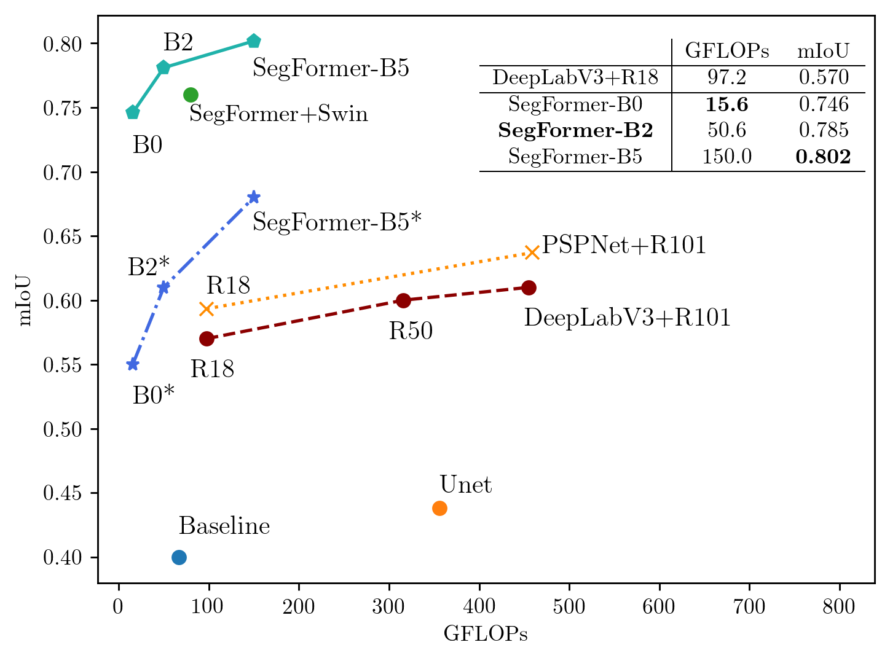
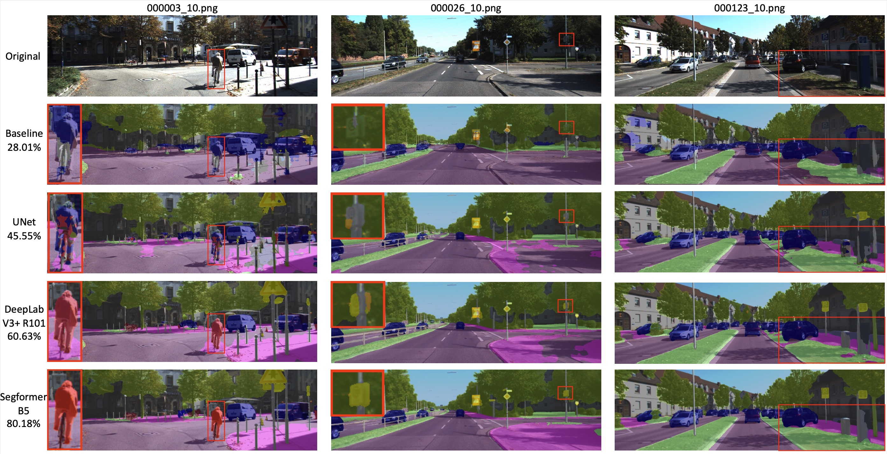

  
  
&nbsp;

  

      <a href="https://github.com/AkideLiu">
        <b>Akide Liu</b>
      </a> &nbsp;&nbsp;&nbsp;&nbsp;&nbsp;&nbsp;&nbsp;&nbsp;&nbsp;&nbsp;&nbsp;&nbsp;&nbsp;&nbsp;&nbsp;&nbsp;&nbsp;&nbsp;&nbsp;&nbsp;&nbsp;&nbsp;&nbsp;&nbsp;&nbsp;&nbsp;&nbsp;&nbsp;&nbsp;&nbsp;&nbsp;&nbsp;&nbsp;&nbsp;
      <a href="https://github.com/Anzhu-W">
        <b>Zihan Wang</b>
      </a>
  

  
&nbsp;

   

      School of Computer Science
    &nbsp;&nbsp;&nbsp;&nbsp;
      School of Computer Science
  

     

      University of Adelaide
    &nbsp;&nbsp;&nbsp;&nbsp;&nbsp;&nbsp;&nbsp;&nbsp;&nbsp;&nbsp;&nbsp;&nbsp;&nbsp;&nbsp;&nbsp;
       University of Adelaide
  

  
&nbsp;

 

[📘Documentation](https://mmsegmentation.readthedocs.io/en/latest/) |
[🛠️Installation](https://mmsegmentation.readthedocs.io/en/latest/get_started.html) |
[👀Model Zoo](https://mmsegmentation.readthedocs.io/en/latest/model_zoo.html) |
[🆕Update News](https://mmsegmentation.readthedocs.io/en/latest/changelog.html) |
[🤔Reporting Issues](https://github.com/open-mmlab/mmsegmentation/issues/new/choose)

English | [简体中文](README_zh-CN.md)

---

<h1 id="sec:abs">ABSTRACT</h1>

This competition focus on Urban-Sense Segmentation based on the vehicle camera view. Class highly unbalanced Urban-Sense images dataset challenge the existing solutions and further studies. Deep Conventional neural network-based semantic segmentation methods such as encoder-decoder architecture and multi-scale and pyramid-based approaches become flexible solutions applicable to real-world applications. In this competition, we mainly review the literature and conduct experiments on transformer-driven methods especially SegFormer, to achieve an optimal trade-off between performance and efficiency. For example, SegFormer-B0 achieved 74.6% mIoU with the smallest FLOPS, 15.6G, and the largest model, SegFormer-B5 archived 80.2% mIoU. According to multiple factors, including individual case failure analysis, individual class performance, training pressure and efficiency estimation, the final candidate model for the competition is SegFormer-B2 with 50.6 GFLOPS and 78.5% mIoU evaluated on the testing set.

<h1 id="sec:intro">Background</h1>

Deep learning has been very successful when working with images as
data and is currently at a stage where it works better than humans on
multiple use-cases. The most critical problems humans have been
interested in solving with computer vision are image classification,
object detection and segmentation in the increasing order of their
difficulty. In the plain old image classification task, people are just
interested in getting the labels of all the objects present in an image.
In object detection, researchers come further a step and try to know all
objects in an image and the location at which the objects are present
with the help of bounding boxes. Image segmentation takes it to a new
level by trying to find out accurately the exact boundary of the objects
in the image.

In this study, we, as beginners in the field of Computer Vision, aim
to develop a basic understanding of semantic segmentation by reviewing,
evaluating, and tuning existing methods, thereby providing a terrific
solution that satisfies both efficiency and accuracy criteria to the
given road segmentation task.

  

<h2 id="report-structure">Report Structure</h2>

The remaining parts of this report are organized as follows. Section
<a href="#sec:method" data-reference-type="ref"
data-reference="sec:method">2</a> reviews the baseline model and
introduces methods and tricks to be applied. Experiments are conducted
in Section <a href="#sec:experiment" data-reference-type="ref"
data-reference="sec:experiment">3</a>, and Section <a
href="#sec:conclusion" data-reference-type="ref"
data-reference="sec:conclusion">4</a> concludes the report.

<h1 id="sec:method">1. Method</h1>
<h2 id="baseline-model-analysis">1.1 Baseline Model Analysis</h2>

The Baseline model comprises an Encoder-Decoder architecture.
Basically, it extracts the feature maps from the image input and
transforms them into the latent representation. The decoder network then
retrieves those latent-space representations to perform predictions.
Here, the latent-space representation refers to a high channel feature
representation that combines useful underlying semantic information.

The encoder incorporates four downsampling layers to determine the
intermediate features map. During the downsampling process, the
activation function adopts RELU to improve the model’s non-linearity.
MaxPooling plays a significant role during the downsampling operations
for spatial invariance; the pooling layer selects the maximum value of
the current view. The convolutional layers take corresponding input
channels [64, 128, 256, 512, 2048] with kernel size 3x3 and stride 2.
The relatively small kernel decreases the number of parameters and also
enhances the non-linearity; here, the stride is the moving step for the
nearby convolution set to 2 to increase the receptive field.

Also, we found that the baseline network is very similar to FCN,
which is the fundamental work of semantic segmentation.

<strong>FCN</strong> .
Long et al. first proposed using FCNs trained end-to-end for semantic
segmentation. FCN utilizes a skip architecture that integrates semantic
information from a deep, coarse layer with appearance information from a
shallow, fine layer to produce accurate and detailed segmentations. FCNs
have only locally connected layers, such as convolutions, pooling and
upsampling, avoiding any densely connected layer. It also uses skip
connections from its pooling layers to fully recover fine-grained
spatial information lost during downsampling .

<h2 id="networks-architecture-exploration">1.2 Networks Architecture
Exploration</h2>

<strong><u>CNN.</u></strong> CNNs have been found quite efficacious
for many computer vision tasks in recent years . They act as trainable image
filters that can convolve over images sequentially to measure responses
or activations of the input image, creating feature maps. These feature
maps are then piled together, passed through non-linear functions, and
further convolved with more filters . This convolution process effectively extracts
visual features or patterns in images that can be useful for tasks such
as classification, segmentation, and super-resolution . In this study, we first
explore three CNN-based architectures for semantic segmentation: ResNet,
U-Net and DeeplabV3, which we now review briefly.

<strong>U-Net </strong>. U-Net is an
encoder-decoder architecture that uses CNNs. Encoder-decoder networks,
as the name suggests have two parts - an encoder and a decoder. The
encoder is responsible for projecting the input feature vectors into a
low-dimensional space in which similar features lie close together. The
decoder network takes features from this low dimensional space as input
and endeavours to reproduce the original input features. Thus, the
output of the encoder or, conversely, the input of the decoder is called
the bottleneck region where a low dimensional representation is present.
Encoder-decoder networks have been found to be adequate for diverse
tasks such as language translation and image segmentation.

<strong>ResNet</strong> . The Deep Residual Nets (ResNet)
model is initially proposed by He et al. to build a deep structure
neural network for image classification. ResNet is a very popular DCNN
model that won the annual ImageNet Large Scale Visual Recognition
Challenge (ILSVRC) in 2015 for the classification task. The successfull
achievement of ResNets model is then followed by other deep learning
models as a framework to ease training of the respective model. We use
three ImageNet pre-trained ResNet models as feature extractors of
DeepLabV3 models.

<strong>DeepLabV3</strong> . DeepLabV3 utilizes atrous
convolutions along with spatial pyramid pooling which enlarges the field
of view of filters to incorporate a larger context and controls the
resolution of features extracted. Employing atrous convolutions in
either cascade or in parallel captures multi-scale context due to the
use of multiple atrous rates. DeepLabV3 uses a backbone network such as
a ResNet as its main feature extractor except that the last block is
modified to use atrous convolutions with different dilation rates. This
study explored the performance of DeepLabV3 as a semantic segmentation
model using three ImageNet pre-trained ResNet models, namely: ResNet18,
ResNet50, and ResNet101 .

Among all the CNN models mentioned above, the problems of spatial
information extraction, edge reconstruction, and lightweight designs are
solved to some extent; however, the global relations establishment
problem is far from resolved. Therefore, we introduce transformers for
segmentation.

<strong><u>Transformer-based models.</u></strong>Transformer
architecture is good at establishing global relations since the
attention-mechanism-based designs compose the basic transformer unit but
are less robust at extracting local information . Therefore, the transformer
architecture can perfectly resolve the four problems by referring to CNN
designs. A shift from CNNs to transformers recently began with the
Vision transformer (ViT). Basically, it treats each image as a sequence
of tokens and then feeds them to multiple Transformer layers to make the
classification. It is the first work to prove that a pure Transformer
can achieve state-of-the-art performance in image classification .

Based on the pioneering work, many subsequent works made
advancements. For instance, SETR  and TransUNet adopted skip connections to
connect shallow and deep layers, surpassing CNN-based models in
segmentation tasks. However, those Transformer-based methods have high
computation complexity, damaging the application of the transformer in
segmentation tasks .

Therefore, a lightweight transformer design is urgently needed. To
this matter, SegFormer proposed a simple and efficient design without
positional encoding and uses a simple decoder (segmentation head) to
obtain the final segmentation results, thus, achieving a competitive
performance to the models with the same complexity .

<strong>SegFormer.</strong> SegFormer is a simple, efficient yet
powerful semantic segmentation framework which unifies Transformers with
lightweight multilayer perceptron (MLP) decoders. SegFormer has two
appealing features:

<ol>
<li>
SegFormer comprises a novel hierarchically structured Transformer
encoder which outputs multiscale features. It does not need positional
encoding, thereby avoiding the interpolation of positional codes which
leads to decreased performance when the testing resolution differs from
training.
</li>
<li>
It avoids complex decoders. The proposed MLP decoder aggregates
information from different layers, and thus combining both local
attention and global attention to render powerful
representations.
</li>
</ol>

To better understand SegFormer, we analysed its network
architecture: 
Encoder – Layered Transformer produces high resolution low-level
features and low-resolution detail features. 
Decoder – A lightweight full MLP decoder fuses multi-level features to
obtain semantic segmentation results. 

<strong>Hierarchical Transformer Encoder </strong> The author designed a
series of MiT (Mix Transformer encoder) encoder models (MiT-B0 to B5),
which have the same structure but different model sizes. The MiT design
is inspired by ViT, but some optimizations have been made for semantic
segmentation tasks.

<ul>
<li>
<strong>Hierarchical Feature Representation</strong>. ViT can
only generate single-resolution feature maps, similar to CNN’s
multi-scale feature maps, MiT generates feature maps of different
scales, and the resolution of the generated feature maps is 1/4 1/8 1/16
1/32 of the original image.
</li>
<li>
<strong>Overlapped Patch Merging</strong>. Patch Embedding of ViT
is non-overlapping (non-overlapping), but non-overlapping will lead to
discontinuous patch edges for semantic segmentation tasks. MiT uses
overlapped patch embedding to ensure that the patch edges are
continuous.
</li>
<li>
<strong>Efficient Self-Attention</strong>. The main computational
bottleneck of Transformer is the Attention layer. Let the dimension of
Q, K, V be [N, C] (N=H*W), and the attention calculation can be
formulated as follows:
</li>
</ul>

$$\operatorname{Attention}(Q, K,
V)=\operatorname{Softmax}\left(\frac{Q
K^{\top}}{\sqrt{\operatorname{d}_{\text {head }}}}\right) V$$

The complexity of the attention calculation is O(<em>n</em>2), When dealing with
large-resolution images, SegFormer introduces a decay ratio R, and uses
FC layer to reduce the amount of Attention calculation. The dimension of
K is [N, C], what it does is to reshape it to [N/R, C*R] first, and then
change the dimension to [N/R, C] through the fully connected layer,
thereby reduce the computational complexity to O(<em>N</em>2/ R). R is set to [64,
16, 4, 1] from stage1 to stage4, respectively .

$$\begin{aligned}
&amp;\hat{K}=\text { Reshape }\left(\frac{N}{R}, C \cdot R\right)(K) \\
&amp;K=\operatorname{Linear}(C \cdot R, C)(\hat{K})
\end{aligned}
% \end{equation}
% \begin{equation}
%     K=\operatorname{Linear}(C \cdot R, C)(\hat{K})$$

<strong>Mix-FFN (Feed-forward Network) </strong> : The author believes
that, instead of acquiring positional encoding, information between
adjacent pixels is more necessary for semantic segmentation tasks. A
convolutional layer is applied in the MLP forward propagation (depthwise
separable convolution is used to reduce the amount of parameters). The
process can be formulated as follows: <strong>x</strong>out = MLP (GELU(Conv3 × 3(MLP(<strong>x</strong><em>i</em><em>n</em>))))⋅<strong>x</strong>in
Experiments show that, 3x3 convolution can provide sufficient position
information for the transformer.

<strong>Lightweight All-MLP Decoder</strong>. For feature maps <em>F</em><em>i</em> of different
resolutions, upsample them to 1/4, and then concat multiple feature maps
and send them to the subsequent network to obtain segmentation
results.

$$\begin{aligned}&amp;\hat{F}_{i}=\operatorname{Linear}\left(C_{i},
C\right)\left(F_{i}\right), \forall i
\\&amp;\hat{F}_{i}=\operatorname{Upsample}\left(\frac{W}{4} \times
\frac{W}{4}\right)\left(\hat{F}_{i}\right), \forall i
\\&amp;F=\operatorname{Linear}(4 C,
C)\left(\operatorname{Concat}\left(\hat{F}_{i}\right)\right), \forall i
\\&amp;M=\operatorname{Linear}\left(C, N_{c l
s}\right)(F),\end{aligned}$$ Note that SegFormer can be seen as a
solid baseline for semantic segmentation since it achieves not only new
state-of-the-art results on many datasets, but also shows strong
zero-shot robustness. However, in this study, we only focus on its
efficiency and performance, i.e. miou. Experiments have been conducted
on 3 SegFormer models, namely <strong>SegFormer-B0</strong>,
<strong>SegFormer-B2</strong> and <strong>SegFormer-B5</strong>.

<h1 id="sec:experiment">3. Experiments</h1>
<h2 id="dataset-description">3.1 Dataset Description</h2>

<strong>Cityscapes.</strong> The Cityscapes dataset  contains
images from the driver’s perspective acquired in cities in Germany and
neighbouring countries. The dataset provides 2MPx images split into
Train, Val and Test subsets, where the semantic labels for the test
subset are not publicly available. There are 19 label classes used for
evaluation which we train upon. Train and Val subsets consist of 2,975
and 500 finely annotated images, respectively. We use this dataset for
pre-train purposes.

<strong>KITTI.</strong> The KITTI semantic segmentation dataset  was collected in
Karlsruhe, Germany, while driving through the city and surrounding area.
It provides 200 images for training and 200 images for testing at
1242x370px. The dataset uses the Cityscapes labelling policy.

<strong>Target Dataset.</strong> Contains 150 training images and 50
testing images. The given dataset is a subset of the KITTI semantic
segmentation training set.

<table>
<thead>
<tr class="header">
<th style="text-align: left;"><strong>Model Architecture</strong></th>
<th style="text-align: center;"><strong>Pretrained Encoder</strong></th>
<th style="text-align: center;"><strong>Pretrained Decoder</strong></th>
<th style="text-align: center;"><strong>MIOU</strong></th>
<th style="text-align: center;"><strong>FLOPs</strong></th>
</tr>
</thead>
<tbody>
<tr class="odd">
<td style="text-align: left;">Baseline 180 Epochs Baseline</td>
<td style="text-align: center;">○</td>
<td style="text-align: center;">○</td>
<td style="text-align: center;"><strong>0.2760</strong></td>
<td rowspan="2" style="text-align: center;">67.003G</td>
</tr>
<tr class="even">
<td style="text-align: left;">Baseline 1000 Epochs</td>
<td style="text-align: center;">○</td>
<td style="text-align: center;">○</td>
<td style="text-align: center;">0.4271</td>
</tr>
<tr class="odd">
<td style="text-align: left;">Unet</td>
<td style="text-align: center;">○</td>
<td style="text-align: center;">○</td>
<td style="text-align: center;">0.4555</td>
<td style="text-align: center;">356G</td>
</tr>
<tr class="even">
<td style="text-align: left;">Deeplabv3Plus &amp; ResNet18</td>
<td style="text-align: center;">●</td>
<td style="text-align: center;">○</td>
<td style="text-align: center;">0.5682</td>
<td style="text-align: center;">97.193G</td>
</tr>
<tr class="odd">
<td style="text-align: left;">Deeplabv3Plus &amp; ResNet50</td>
<td style="text-align: center;">●</td>
<td style="text-align: center;">○</td>
<td style="text-align: center;">0.6041</td>
<td style="text-align: center;">316G</td>
</tr>
<tr class="even">
<td style="text-align: left;">Deeplabv3Plus &amp; ResNet101</td>
<td style="text-align: center;">●</td>
<td style="text-align: center;">○</td>
<td style="text-align: center;">0.6063</td>
<td style="text-align: center;">455G</td>
</tr>
<tr class="odd">
<td rowspan="2" style="text-align: left;">Swin v1 Tiny 22k +
SegFormer</td>
<td style="text-align: center;">●</td>
<td style="text-align: center;">○</td>
<td style="text-align: center;">0.5945</td>
<td rowspan="2" style="text-align: center;">79.472G</td>
</tr>
<tr class="even">
<td style="text-align: center;">●</td>
<td style="text-align: center;">●</td>
<td style="text-align: center;">0.7628</td>
</tr>
<tr class="odd">
<td style="text-align: left;">SegFormer B0*</td>
<td style="text-align: center;">●</td>
<td style="text-align: center;">○</td>
<td style="text-align: center;">0.5533</td>
<td style="text-align: center;">15.579G</td>
</tr>
<tr class="even">
<td style="text-align: left;">SegFormer B2*</td>
<td style="text-align: center;">●</td>
<td style="text-align: center;">○</td>
<td style="text-align: center;">0.6141</td>
<td style="text-align: center;">50.633G</td>
</tr>
<tr class="odd">
<td style="text-align: left;">SegFormer B5*</td>
<td style="text-align: center;">●</td>
<td style="text-align: center;">○</td>
<td style="text-align: center;">0.6842</td>
<td style="text-align: center;">150G</td>
</tr>
<tr class="even">
<td style="text-align: left;">SegFormer B0</td>
<td style="text-align: center;">●</td>
<td style="text-align: center;">●</td>
<td style="text-align: center;">0.7460</td>
<td style="text-align: center;"><strong>15.579</strong>G</td>
</tr>
<tr class="odd">
<td style="text-align: left;"><strong>SegFormer B2</strong></td>
<td style="text-align: center;">●</td>
<td style="text-align: center;">●</td>
<td style="text-align: center;">0.7845</td>
<td style="text-align: center;">50.633G</td>
</tr>
<tr class="even">
<td style="text-align: left;">SegFormer B5</td>
<td style="text-align: center;">●</td>
<td style="text-align: center;">●</td>
<td style="text-align: center;"><strong>0.8018</strong></td>
<td style="text-align: center;">150G</td>
</tr>
<tr class="odd">
<td style="text-align: left;">PSPNet &amp; ResNet18</td>
<td style="text-align: center;">●</td>
<td style="text-align: center;">○</td>
<td style="text-align: center;">0.5933</td>
<td style="text-align: center;">97.213G</td>
</tr>
<tr class="even">
<td style="text-align: left;">PSPNet &amp; ResNet101</td>
<td style="text-align: center;">●</td>
<td style="text-align: center;">○</td>
<td style="text-align: center;">0.6370</td>
<td style="text-align: center;">459G</td>
</tr>
<tr class="odd">
<td style="text-align: left;">CWD PSPNet &amp; R18(S) R101(T)</td>
<td style="text-align: center;">●</td>
<td style="text-align: center;">○</td>
<td style="text-align: center;">0.5449</td>
<td style="text-align: center;">99 G</td>
</tr>
</tbody>
</table>

<h2 id="experiment-workflow">3.2 Experiment Workflow</h2>

We implement our experiments with PyTorch and MMSegmentation  open-source
toolbox. Most experiments are conducted on a server with 4 RTX A5000; we
also configure and train models locally on one RTX 3080 Ti and one MPS
device.

As a starting point, we directly train and run the baseline model
with default settings for 180 epochs, and by evaluating, we obtain a
mIoU of 0.2760, which is an abysmal result. To improve the model
performance, we decided to follow the tricks in the notebook and see if
a better result could be obtained. All results are displayed in <a
href="#tab:bigtable" data-reference-type="ref"
data-reference="tab:bigtable">[tab:bigtable]</a>.

Since we are dealing with a small dataset, data augmentation can be
applied. We conducted multiple manipulations including RandomCrop,
RandomFlip, PhotoMetricDistortion, Resize, Normalize and Pad to training
samples ;
by training 1000 epochs, the mIoU increased from 0.3831 to 0.4271,
demonstrating a significant performance improvement. Therefore we retain
the argumentation strategy in all subsequent experiments. Following the
hints, we slightly modify the baseline model architecture to a UNet,
achieving a mIoU of 0.4613 for 1000 epochs. Since all hypermeters used
so far are default, the next step is to tune the network. As it is known
that the tuning process is more empirical than theoretical in deep
learning, we did a board search and decided to conduct our experiments
on an open-source toolbox — MMSegmentation.

MMSegmentation .
MMSegmentation is an open-source semantic segmentation toolbox based on
PyTorch. It provides a unified benchmark toolbox for various semantic
segmentation methods and directly supports popular and contemporary
semantic segmentation frameworks, e.g. PSPNet, DeepLabV3Plus, SegFormer,
etc. By decomposing the semantic segmentation framework into different
components, the toolbox allows us to easily construct a customized
semantic segmentation framework by combining different modules (e.g.
Splice different encoder/decoder). Besides, it also supports many
training tricks, and the training speed is faster than or comparable to
other codebases since it supports DDP/DP. The toolbox enables us to
tune/switch our model efficiently, quickly and intuitively and allows us
to explore more experiments in a limited time. To ensure the
dependability of the toolbox mmseg, we retested previous experiments,
and precisely the same results are obtained by setting the Cuda seed
unchanged (mIoU = 0.2760). Since the toolbox does not support our
dataset, we wrote a data loader compatible with our dataset and the open
community dataset KITTI. We are continuously updating the code with the
support of MMSegmentation, aiming to contribute to the open-source
community. Note that our source code can be reproduced in general
practice, i.e. outside the MMSegmentation codebase.

To get a rough idea of how far we might be able to reach, we further
explore the performance of the strong baseline DeepLabV3Plus as a
semantic segmentation model using three ImageNet pre-trained Resnet
models, namely: ResNet18, ResNet50, and ResNet101. Even with default
hyperparameters, all three models achieve mIoU around 0.60, which is
better but also shows that there is still room for improvement.

By looking at multiple SOTA ranking lists, we found that most top
ones are transformer-based models. Therefore, we started to look into
transformers. Taking into account the balance of efficiency and
performance, we measure multiple models and eventually choose SegFormer
— a simple, efficient and powerful semantic segmentation framework that
unifies Transformers with lightweight multilayer perceptron (MLP)
decoders. During the process of the development network, we have tried
to switch SegFromer’s original backbone to Swin Tiny Transformer  as it pre-trained on
ImageNet 22K. After changing the architecture, the pre-trained model on
cityscapes was obtained, which takes 8 hours via 4 Nvidia A5000 GPUs.
The performance for Swin Tiny + SegFromer products is relatively high;
however, the FLOPs of this modified architecture increased exponentially
since this modified architecture will not consider for further
optimization.

  

<h2 id="experiment-with-segformer-useful-tricks">3.3 Experiment with
SegFormer (Useful tricks)</h2>

The SegFromer contains six sizes of encoder and decoder to cover both
efficiency and performance. We experimentally optimized hyperparameters
and applied tricks on the most miniature model, Segformer-B0, which is
suitable for faster development and reduces computational cost on our
local machine. After optimal hyper-parameter or efficient tricks are
employed in the model, we duplicate the exact strategies to the larger
models (B2 and B5) and push them to cloud servers to perform distributed
training and evaluation. This workflow allows large batch sizes, large
crop sizes, sync batch normalization and multiple scales
training/testing to improve model performance; furthermore, distribution
data parallelism, multiple GPUs cross gradient descent to reduce
training duration.

<h3 id="transfer-learning">Transfer learning</h3>

Transfer learning is a machine learning technique where a model
trained on one task as an optimization allows rapid progress or improved
performance when modelling the second task . After a manual examination of the
dataset properties and attributes, we found that this dataset belongs to
Urban-scene segmentation tasks, and the image size is 1242x375 with 19
classes appropriately labelled. According to these clues and some online
research, more detailed descriptions and information have been
allocated. This dataset is a subset of the KITTI semantic segmentation
benchmark, containing 200 semantically annotated train images, and the
data format conforms with <strong>Cityscapes</strong> Dataset. Note that
we did not use the Original KITTI dataset as data enhancement for this
competition because our testing set is also the subset of the KITTI
training set to avoid biased performance. Some research shows that
models trained on a large dataset such as Cityscapes have well
generalization ability for unseen data. Therefore, we decided to use
Cityscapes pre-trained weights to consolidate our task  . The reuse model is a
methodology for inductive transfer learning; the Cityscapes pre-trained
model is used as the starting point instead of random initialization or
batches normal initialization. <strong>After employing transfer
learning, the model performance increased from 61.41% to 68.31%
mIoU.</strong>

<h3 id="learning-rate-scheduler">Learning Rate Scheduler</h3>

Some research shows that the learning rate is one of the most
important hyperparameters for deep learning because it directly affects
the gradient descents and controls the speed of network convergence to
the point of global minima by navigation through a non-convex loss
surface .
How find an optimal learning rate becomes a huge challenge for our
experiments. After several experiments, we used a polynomial learning
rate policy with a warm restart. The following equation defines the
polynomial learning rate for the task of semantic image segmentation.
Here, <em>l</em><em>r</em>0
is the initial or base learning rate, <em>i</em> denotes the number of iterations,
and <em>T</em><em>i</em> is
the total number of iterations. In case of polynomial learning rate
policy, <em>T</em><em>i</em>
is equal to the total number of epochs times number of iterations in an
epoch. Power term controls the shape of learning rate decay. Our optimal
parameters are <em>l</em><em>r</em>0 = 1<em>e</em> − 5, <em>p</em><em>o</em><em>w</em><em>e</em><em>r</em> = 1.0, <em>T</em><em>i</em> = 20000.
Furthermore, use AdamW optimizer , which leverages the L2 normalization
and weight decay with Adam optimizer. <strong>After employing a learning
rate scheduler, the model performance increased from 68.31% to 72.34% mIoU.</strong>

$$\begin{aligned}
    l r=l r_{0} *\left(1-\frac{i}{T_{i}}\right)^{\text {power }}
    \end{aligned}$$

    

<h3 id="class-balanced-loss">Class Balanced Loss </h3>
<ul>
<li>
The urban-scene images have distinct nature related to
perspective geometry and positional patterns. Since the urban-scene
images are captured by the cameras mounted on the front side of a car,
the urban-scene datasets consist only of road-driving pictures. This
leads to the possibility of incorporating common structural priors
depending on a spatial position, markedly in a vertical position. The
class distribution diagram of the target dataset is shown in <a
href="#fig:class_distribution" data-reference-type="ref"
data-reference="fig:class_distribution">[fig:class_distribution]</a>.
</li>
<li>
After manually examining the dataset, we write a simple pixels
distribution analyzer for visualization and calculate the class balanced
loss. The collected class balanced weights added to CrossEntropyLoss
generate a class balanced loss.
</li>
<li>
A re-weighting scheme uses an adequate number of samples for each
class to re-balance the loss, yielding a class-balanced loss.
</li>
<li>
The class-balanced loss is designed to address the problem of
training from imbalanced data by introducing a weighting factor that is
inversely proportional to the adequate number of samples.
</li>
<li>
<strong>After employing Class Balanced Loss, the model
performance increased from 72.34% to 74.67% mIoU.</strong>
</li>
</ul>

$$\mathrm{CE}_{\mathrm{softmax}}(\mathbf{z}, y)=-\log \left(\frac{\exp \left(z_{y}\right)}{\sum_{j=1}^{C} \exp \left(z_{j}\right)}\right)$$

<h3 id="online-hard-example-mining-ohem">Online Hard Example Mining
(OHEM) </h3>
<ul>
<li>
The OHEM algorithm (online hard example miniing, CVPR‘16) is
mainly for automatic selection of difficult samples in the training
process. larger samples), and then apply these filtered samples to
training in stochastic gradient descent.
</li>
<li>
Only pixels with confidence score under thresh are used to train.
And we keep at least <em>m</em><em>i</em><em>n</em><em>k</em><em>e</em><em>p</em><em>t</em>
pixels during training. If thresh is not specified, pixels of top <em>m</em><em>i</em><em>n</em><em>k</em><em>e</em><em>p</em><em>t</em>
loss will be selected. The optimal parameters for OHEM are <em>t</em><em>h</em><em>r</em><em>e</em><em>s</em><em>h</em> = 0.5, <em>m</em><em>i</em><em>n</em><em>k</em><em>e</em><em>p</em><em>t</em> = 10<em>k</em>
</li>
<li>
<strong>After employing OHEM the model performance increased from
74.64% to 75.98% mIoU.</strong>
</li>
</ul>
<h3 id="multiple-scale-testing">Multiple Scale Testing </h3>

The multiple scale testing generates the input images and features
maps to different scales, determines the region proposal and combines
the region proposal for mixed scale input to the network evaluation. The
multiple scales are widely used in object detection to reduce the
detection difficulty for some small targets. For example, the SSD makes
detection from multiple feature maps; however, the bottom layers are not
selected for object detection. They are in high resolution, but the
semantic value is not high enough to justify their use as the speed
slow-down is significant. So SSD only uses upper layers for detection
and performs much worse for small objects. This method has been
implemented in our codebase, creating multiple-scale images input for
prediction and averaging the scores as the final prediction.
<strong>After employing multiple-scale testing/training, the model
performance increased from 75.98% to 78.12% mIoU.</strong>

<h3 id="auxiliary-loss">Auxiliary Loss </h3>

As the network becomes deeper, the training progress decreases
because of vanishing gradient issues. To reduce the impact, auxiliary
loss with suitable weights helps optimize the learning process, while
the main branch loss takes the most responsibility. In our experiment,
we added the FCN layer as an auxiliary head to interrupt the second
intermediate layer to make predictions and calculate the auxiliary loss.
Then merge auxiliary loss with main loss from decoder head. In our
implementation, the auxiliary loss weight is 0.4 against the main loss
weight of 1.0. <strong>After employing Auxiliary loss, the model
performance increased from 78.12% to 78.45% mIoU.</strong>

<h1 id="sec:conclusion">4. Conclusion and Future Prospects</h1>

Overall, by applying the strong baseline SegFormer we achieve
fantastic results. The most efficient-performance balanced model
SegFormer-B2 (FLOPs = 79.472G), a mIoU of 0.7845 is obtained. With the
strongest SegFormer-B5, mIoU = 0.8018 is reached with FLOPs = 150G. A
great model and thoughtful tuning are essential to produce the best
performance. Transfer learning is also very crucial in improving model
performance, and we will especially focus on exploring this in the
future. During this study, we develop a comprehensive understanding of
the field of deep learning and semantic segmentation. In addition to the
joy of harvesting experiment results, we also develop strong interests
in computer vision. The fly in the ointment is that we are not able to
compose more work due to the time limit — we tried to apply knowledge
distillation (channel-wise distillation) to our model, and relevant
experiments have been successfully conducted on a PSPNet model . We will keep working on
this; ideally, we can successfully employ it on the top-performing model
within two weeks.

